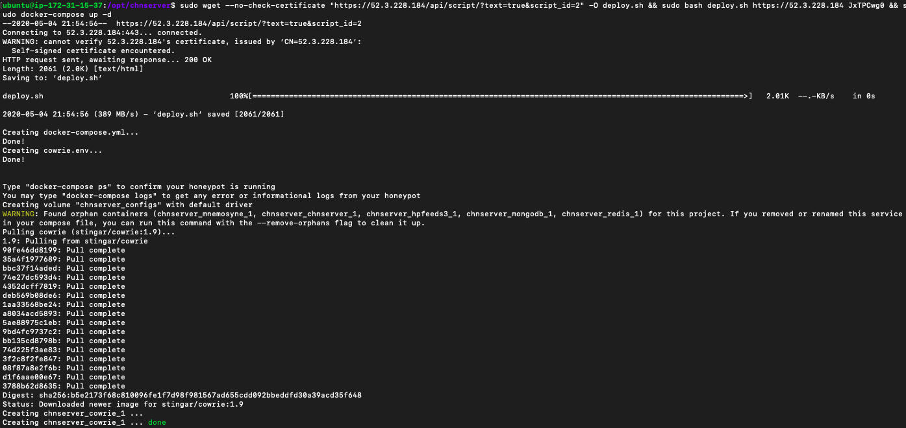

Deploying Your First Honeypot
=============================
## Deploy a Cowrie honeypot
Switch to your web browser and log into the web portal for CHN Server (if your tab isn't already up).

From the menu at the top left, click "Deploy" in the menu bar. Next select the field labeled "Script" and select the 
"Ubuntu - Cowrie" option. 

Next, Copy the "Deploy Command" from the web interface. Switch to the SSH terminal for your honeypot host and paste the 
"Deploy Command" into the terminal for workshop-chn-hp-$TEAM.security.duke.edu. The script will generate the 
appropriate `docker-compose.yml` and `sysconfig` files, 
then start the docker-compose process to retrieve and run the images. Your output should look similar to the below:

Once the honeypot has been deployed, switch back the the CHN Server web interface. Select the "Sensor" tab from 
the menu and verify that the honeypot has successfully registered to CHN Server.

