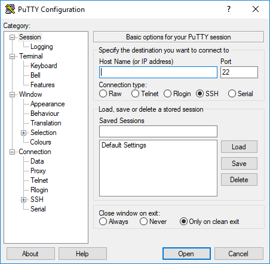
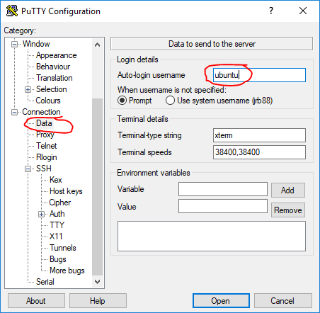

Using SSH Clients
===========
This workshop (and the CHN Project) requires using SSH clients and Linux commands. Please don't be afraid to ask for 
help if you're experiencing issues and need assistance.

This section provides basic information on getting an SSH client set up on Windows. Mac OS X and Linux have native 
clients that are familiar to most power users.

## Windows
### Native OpenSSH Client
If you're running Windows 10, you can actually use a built-in SSH client! 

To use the Windows 10 SSH client, ensure the option is installed:

* Settings -> Apps -> Manage Optional Features -> OpenSSH Client

If the client is not already installed, install the client and follow directions on rebooting your machine.

When you're ready to start using the client, Open Powershell. Whenever you see instructions to `export TEAM=` instead
 use the notation `env:TEAM=`. For instance, if you're team 50:

```bash
$env:TEAM=50
``` 

You can then reference it in the command line similarly:

```bash
ssh -l ubuntu -p 4222 workshop-chn-server-$env:TEAM.security.duke.edu 
```

### Putty

You can use the open source client [Putty](https://www.chiark.greenend.org.uk/~sgtatham/putty/).
Once you've downloaded the program, you'll need to adjust the settings for the program to run. 

* Settings -> Apps -> Installing Apps -> "Warn me before installing apps from outside the store"

Download the [64 bit Putty client here](https://the.earth.li/~sgtatham/putty/latest/w64/putty.exe).

Now browse to the location of the Putty executable you downloaded and run the program. You may consider moving the 
program to somewhere easily accessible like your Desktop. Once you run Putty, you should see a welcome screen:



Taking the time save a profile for your hosts will speed things later. To make a profile, navigate in the settings to
 the Connection -> Data section, and fill in `ubuntu` in the section for `Auto-login username`:
 


Next, return to the top level Category `Session`. You'll want to fill out `Host Name (or IP address)` with the FQDN 
of our host (i.e., `workshop-chn-server-0.security.duke.edu`). Change the `Port` to be `4222` and add a name for our
 profile in `Saved Sessions`. Your screen should look similar to this:
 

 
Once you click `Save` your new profile should appear in the box under the "Default Settings" entry. You can now 
highlight your new profile and select `Open` to create a connection to the host. 

The first time you connect to a host, you'll receive a warning about the host key being unkown. It is generally safe to 
accept this warning the first time you connect to a host.


If everything went well, you should see a password prompt. Enter your password in a timely manner to complete the 
connection!


Repeat this process to build a profile for your honeypot server as well (i.e., `workshop-chn-hp-0.security.duke.edu`)

## Mac OS X
On Mac OS X, you can simply open the Terminal.app and issue the commands provided in the workshop. A shortcut is to 
use the key shortcut `META-space`, type `terminal` and hit enter.
